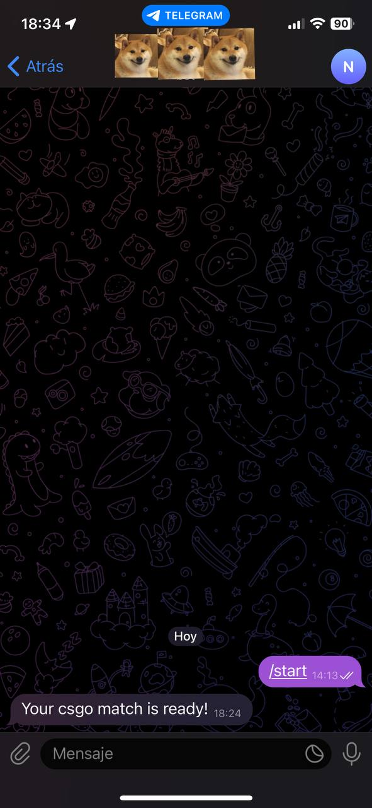

# CSGO-AutoAccept
Automatically accepts a csgo match when found VAC risk free. (Will search for pixels on the screen and will click when matching the accept button).

Features
--------
- [x] Telegram notification when a match is found (Optional)
- [x] Auto accept a match when found
--------

How to use it:

* Download the executable [here](https://github.com/davidarroyo1234/CSGO-AutoAccept/releases).
* Open the executable.
* Select the mode you want to use. 
  * 1 Is to use the autoaccept and receive a telegram notification when a match is found.
    * If you selected 1 you will need to enter your telegram bot token
  * 2 Is just the autoaccept without the telegram notification.
  * 3 is for deleting the telegram token in case you want to change it or delete it.
* Open csgo and search for a game.
* When the match is ready it will accept it for you :)

*CSGO must be maximized in order to work at least for now*

### Screenshoots

## Legal

**Disclaimer:** This is not affiliated, associated, authorized, endorsed by, or in any way officially connected with Valve or Counter Strike/CSGO.

Use it at your own risk!.